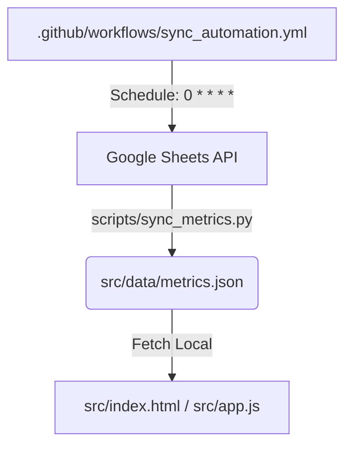

# Coordinación de Subagentes - Dashboard de Métricas CoPA

Este documento define los roles, responsabilidades, flujos de trabajo y límites operativos para los subagentes autónomos de Antigravity 2.0 que participan en el desarrollo y mantenimiento del Dashboard de Métricas de CoPA.

---

## 1. Arquitectura del Proyecto

```
.
+-- .github/workflows/sync_automation.yml   # CI/CD: sync cada hora o push a main
+-- scripts/sync_metrics.py                  # Backend: extracción Google Sheets -> metrics.json
+-- src/                                     # Raíz publicada por GitHub Pages
|   +-- index.html                           # Dashboard principal
|   +-- styles.css                           # Estilos corporativos
|   +-- app.js                               # Lógica frontend (Chart.js)
|   +-- data/metrics.json                    # Caché local de datos (commiteado)
|   +-- assets/logo.png                      # Logotipo institucional
+-- .gitignore                               # Ignora credentials.json, .env, venv/, __pycache__, *.log
+-- .agents/skills/                          # Skills instaladas (no commiteadas)
|   +-- sync-sheet-metrics.md                # Skill de sincronización de datos
|   +-- frontend-design/                     # Skill de diseño frontend (instalada)
|   +-- ui-ux-pro-max/                       # Skill de diseño UI/UX (instalada)
```

---

## 2. Definición de Agentes y Roles

### A. Agente Desarrollador (Frontend & UI/UX)
- **Objetivo Principal:** Diseñar y construir la interfaz web del dashboard.
- **Tecnologías:** HTML5 estático, CSS3, JavaScript nativo, Chart.js (CDN).
- **Identidad Visual:**
  - Paleta: Azul marino `#0B2545`, blanco `#FFFFFF`, gris tenue `#F8F9FA`.
  - Tipografía: Inter (Google Fonts).
  - Logo: `src/assets/logo.png` a la izquierda del título.
  - Título: "Colegio de Profesionales de la Agrimensura".
- **Entregables:**
  - `src/index.html`: Estructura del dashboard, tarjetas KPI, dos filtros independientes, tablas y gráficos.
  - `src/styles.css`: Estilos corporativos responsivos.
  - `src/app.js`: Lógica de KPI, deltas, filtros y renderizado Chart.js.

### B. Agente de Datos (Integración, Backend & Automatización)
- **Objetivo Principal:** Infraestructura de datos para extraer y formatear desde Google Sheets.
- **Tecnologías:** Python 3, `gspread`, `google-auth`, `pandas`, `python-dotenv`.
- **Sheet ID:** `1ggeuKuCFZsUpDfRl2wPLOqWD2in7uL9Y3yHTaui_A0w`
- **Pestañas:** "base de datos", "Expedientes", "Rendición VEP_SCIT", "Capital financiero".
- **Conexión Producción:** Lee `GOOGLE_CREDENTIALS` (GitHub Secret). Fallback local a `credentials.json`.
- **Entregables:**
  - `scripts/sync_metrics.py`: Script de extracción, limpieza y exportación a `src/data/metrics.json`.
  - `.github/workflows/sync_automation.yml`: Workflow que corre cada hora y en push a main.

---

## 3. Límites y Restricciones Operativas (Guardrails)

1. **P R O H I B I C I Ó N de Escritura en Sheets:** Acceso solo lectura.
2. **Aislamiento de Credenciales:** `credentials.json` y `.env` excluidos via `.gitignore`.
3. **Persistencia Local:** Frontend consume `src/data/metrics.json`. Filtros recalcular en memoria vía JS (sin llamadas API externas).
4. **Color en Gráficos:** Ingresos = VERDE (`#27AE60`), Egresos = ROJO (`#E74C3C`). Excepción: tarjetas KPI no siguen esta regla.
5. **Capital Financiero:** Usar paleta diferenciada y viva (NUNCA negro o gris). Proporcionar toggle ARS/USD.

---

## 4. Protocolo de Sincronización y Ejecución



- **Sync:** Automático cada hora via GitHub Actions + en cada push a `main`.
- **Dashboard:** `src/index.html` carga `data/metrics.json` y renderiza todo el dashboard inmediatamente.

---

## 5. Tareas de Desarrollo Asignadas

### Fase 1: Infraestructura
- [x] Crear `.gitignore`
- [x] Crear `.github/workflows/sync_automation.yml`
- [x] Crear `scripts/sync_metrics.py`
- [x] Crear `src/assets/logo.png` (placeholder)

### Fase 2: Datos
- [x] Crear `src/data/metrics.json` (estructura de ejemplo)
- [x] Implementar lógica de extracción y limpieza por pestaña
- [x] Manejo de credenciales: `GOOGLE_CREDENTIALS` env var + fallback local

### Fase 3: Frontend
- [x] Crear `src/index.html` (estructura completa)
- [x] Crear `src/styles.css` (estilos corporativos responsivos)
- [x] Crear `src/app.js` (lógica completa de KPI, filtros, Chart.js)

### Fase 4: Validación
- [ ] Verificar que GitHub Pages despliegue solo `src/`
- [ ] Configurar `GOOGLE_CREDENTIALS` como Secret en el repositorio
- [ ] Probar sync_metrics.py vs la API real de Google Sheets
- [ ] Verificar renderizado de todos los gráficos con datos reales
